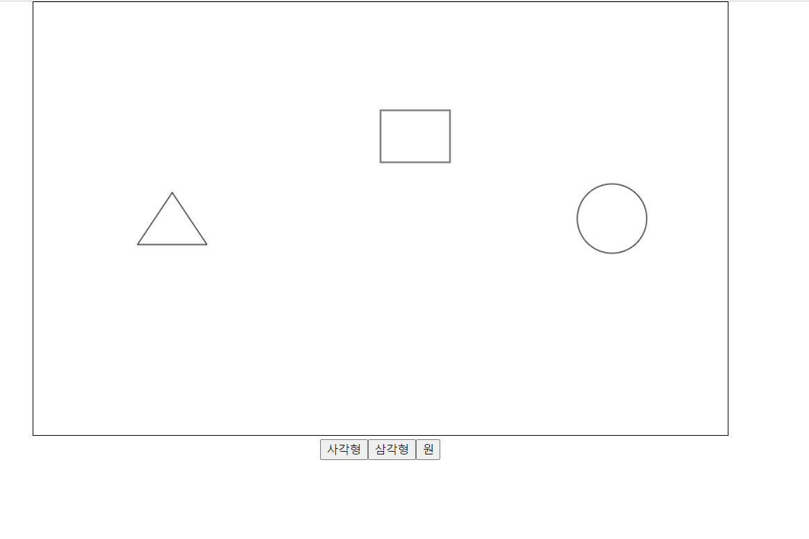
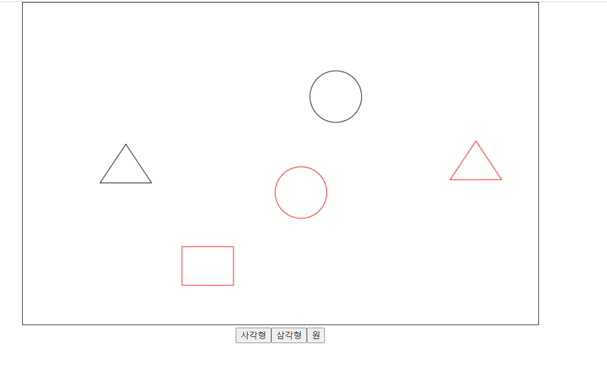
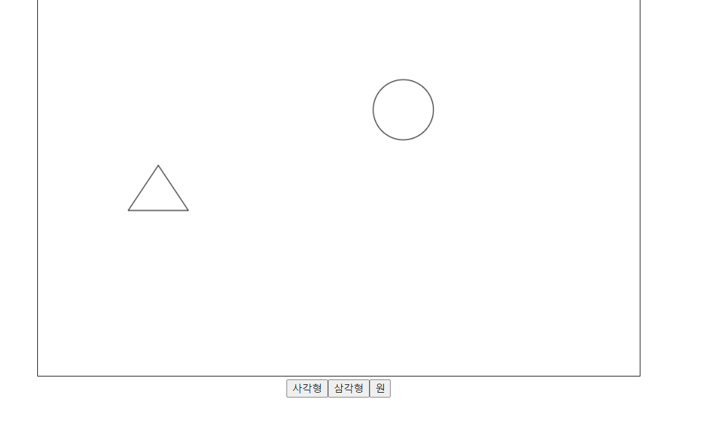

# canvasShape

- windows 11
- vue3
- composition api
- typescript

## 설명

canvas 환경에서 도형들을 그리고 삭제, 이동하도록 한다

## 기능

- button을 눌러 사각형, 삼각형, 원을 canvas에 그림
- 도형 이동
- 선택한 도형(빨강색으로 됨)을 키보드 del을 눌러 삭제

## 결과

