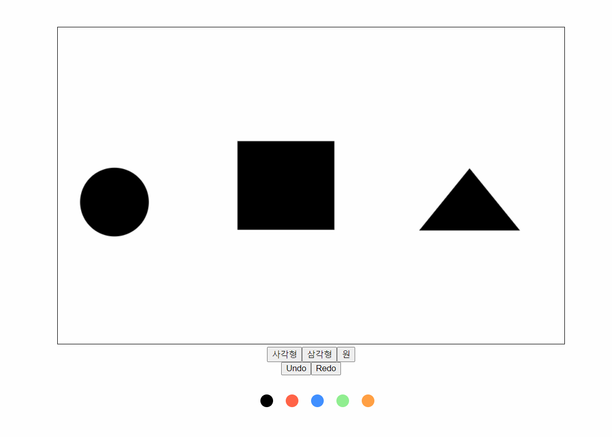
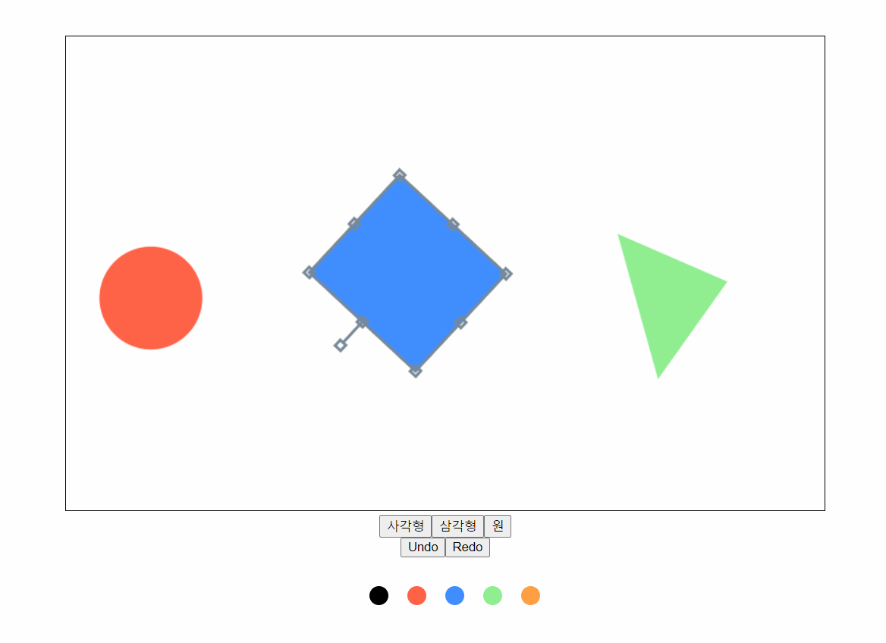

# canvasShape

- windows 11
- vue3
- composition api
- typescript

## 설명

canvas 환경에서 도형을 사용해 이것저것 하는 웹

## 기능

- button을 이용해 도형(사각형, 삼각형, 원) 생성
- 이동
- 크기 변경
- 회전
- 색 변환
- 삭제
- 뒤로가기, 되돌리기
- 키보드 이벤트 연결
  - 뒤로가기(ctrl+z)
  - 되돌리기(ctrl+shift+z)
  - 복사(ctrl+c)
  - 붙여넣기(ctrl+v)
  - 키보드 화살표로 도형 이동
  - ctrl을 누른 상태에서 도형 클릭 시 여러개 클릭 가능

## 예시

- 도형 생성 및 이동
  
- 크기 변경
  
- 회전
  
- 색 변환
  
- 삭제
  
- 뒤로가기, 되돌리기
  
